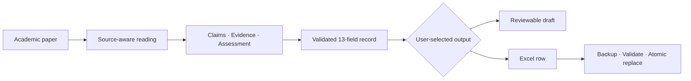

# Paper Reading Skill

**Evidence-grounded AI research workflow**

**English** | [简体中文](README.zh-CN.md)

[](https://github.com/AOROM/paperreading/actions/workflows/ci.yml)

Turn academic papers into structured, reviewable research records. Paper Reading Skill separates source claims, reported evidence, and researcher assessment; preserves uncertainty instead of inventing missing facts; proposes executable follow-up designs; and can safely append validated results to an existing Excel literature-review workbook.

## Why this project

AI can summarize a paper quickly, but a useful research workflow must also answer:

- Which statements come from the paper, and which are interpretation?
- What evidence supports each reported finding?
- Does the identification strategy justify causal language?
- What information is missing or still unconfirmed?
- Can the result enter an existing research system without damaging it?

This project treats those questions as workflow constraints rather than optional writing style.

## Workflow



## Design principles

- **Evidence before interpretation**: distinguish what the paper states, what its results show, and what the reviewer infers.
- **Unknown stays unknown**: never invent a model, variable, test, source, ranking, or causal claim to fill a gap.
- **Causal language follows identification**: describe association as association unless the research design supports a causal interpretation.
- **Structured output remains reviewable**: organize every paper into the same 13-field contract while preserving null results and study limitations.
- **Automation must be reversible**: validate before writing, detect duplicates, create a backup, and replace the workbook atomically.
- **The user controls mutation**: produce a draft unless a workbook path is explicitly supplied or configured.

## What you get

The workflow produces these fields in a fixed order:

`序号` · `论文名称` · `作者` · `期刊` · `期刊等级` · `发表时间` · `关键词` · `研究问题` · `研究结论` · `研究逻辑` · `实证模型` · `数据来源和变量设置` · `可进一步延伸的研究设计`

It can:

- layer baseline findings, mechanisms, heterogeneity, economic consequences, endogeneity treatment, and robustness checks;
- preserve source locations in review notes when page or section information is available;
- propose two to four paper-specific research extensions with executable identification or data designs;
- generate a draft without touching a workbook; or
- safely add the thirteenth field to a compatible 12-column workbook and append a validated row.

## Quick start

1. Clone the repository and install the deterministic writer dependency:

   ```bash
   git clone https://github.com/AOROM/paperreading.git
   cd paperreading
   python -m pip install -r requirements.txt
   ```

2. Copy the skill into your Codex skills directory. Windows PowerShell example:

   ```powershell
   Copy-Item -Recurse -Force `
     .\skills\papers-reading-skill `
     "$env:USERPROFILE\.codex\skills\papers-reading-skill"
   ```

3. Start a new Codex session and invoke `$papers-reading-skill`.

Generate a reviewable draft:

```text
Use $papers-reading-skill to read this paper into 13 evidence-grounded fields. Separate source claims, reported evidence, and your assessment, but do not write to a workbook.
```

Append only after validation:

```text
Use $papers-reading-skill to read this paper. Validate all 13 fields, then append the result to the Chinese worksheet in my configured workbook.
```

## Safe workbook automation

The public repository contains no personal workbook paths. The writer resolves its target in this order:

1. `--workbook <path>` supplied on the command line;
2. the `PAPER_READING_WORKBOOK` environment variable;
3. if neither is available, stop without writing.

PowerShell:

```powershell
$env:PAPER_READING_WORKBOOK = "D:\research\paper-reading.xlsx"
```

Bash:

```bash
export PAPER_READING_WORKBOOK="/data/research/paper-reading.xlsx"
```

Call the deterministic writer directly:

```bash
python skills/papers-reading-skill/scripts/append_paper_reading.py \
  --workbook "/path/to/paper-reading.xlsx" \
  --sheet 中文 \
  --data-json examples/paper-reading.example.json
```

Use `--sheet 中文` for a Chinese paper or `--sheet 英文` for an English paper. The script returns `paper_appended`, `duplicate_skipped`, `schema_updated`, or `error` as JSON. A validation or write error leaves the original workbook unchanged.

## Evidence and ranking boundaries

Field definitions live in [`reading-fields.md`](skills/papers-reading-skill/references/reading-fields.md). Source locations are recorded only when they are available from the supplied material; their absence must not be replaced with invented page numbers or quotations.

Journal rankings are versioned external evidence. Record only labels confirmed by a reliable source, preserve the source system's wording, and never translate one ranking system into another. For evaluation, promotion, reporting, or submission decisions, verify the applicable system, version, and effective date.

## Project structure

```text
paperreading/
├── skills/papers-reading-skill/   # Installable runtime skill
│   ├── SKILL.md
│   ├── agents/openai.yaml
│   ├── references/
│   └── scripts/append_paper_reading.py
├── examples/                      # Synthetic example input
├── tests/                         # Safety and structure tests
├── tools/                         # Repository validation
└── .github/workflows/ci.yml       # Automated validation
```

Repository documentation, tests, and CI configuration stay outside the runtime skill so they do not consume its context budget.

## Development and validation

```bash
python -m pip install -r requirements-dev.txt
python tools/validate_skill.py skills/papers-reading-skill
python -m unittest discover -s tests -v
```

GitHub Actions validates skill metadata and exercises workbook upgrades, duplicate detection, configuration resolution, and failure-safe source preservation.

See [CONTRIBUTING.md](CONTRIBUTING.md) before submitting a change.

## License

This repository currently has no open-source license. Public visibility does not automatically grant permission to copy, modify, or distribute its contents.
