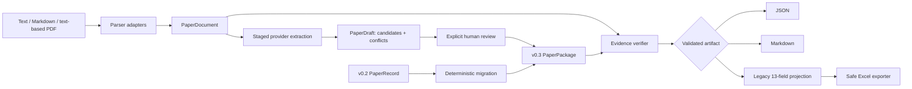

<h1 align="center">PaperReading</h1>

<p align="center">
  
</p>

<div align="center">
  <p><strong>Evidence-grounded AI research workflow</strong></p>
  <p>
    Turn research material into versioned, reviewable artifacts.<br>
    Trace claims to evidence. Separate reporting from analysis. Keep uncertainty visible.
  </p>
  <p>
    <a href="https://github.com/AOROM/paperreading/actions/workflows/ci.yml"></a>
    
    
    <a href="LICENSE"></a>
    <a href="https://github.com/AOROM/paperreading/stargazers"></a>
  </p>
  <p><strong>English</strong> · <a href="README.zh-CN.md">简体中文</a></p>
  <p>
    <a href="#try-it-in-60-seconds">Quick start</a> ·
    <a href="#what-ships-in-v031">Capabilities</a> ·
    <a href="#how-it-works">Architecture</a> ·
    <a href="RESEARCH_PRINCIPLES.md">Research principles</a> ·
    <a href="ROADMAP.md">Roadmap</a> ·
    <a href="CONTRIBUTING.md">Contribute</a>
  </p>
</div>

PaperReading is an alpha-stage Python core and Codex Skill for researchers and research-tool builders who need more than a fluent summary. Its schemas and validators preserve the chain from a source location to a claim, distinguish paper-reported content from later interpretation, guard causal language, and keep legacy research exports reviewable.

> [!IMPORTANT]
> **Current scope:** v0.3.1 ingests UTF-8 text, Markdown, and text-based PDFs; replays staged extraction through an auditable JSON provider; enforces Draft → Review → Finalize; and verifies quotations with local fuzzy alignment. PDF support does **not** provide OCR, layout geometry, table reconstruction, or figure extraction. Hosted AI providers, batch jobs, SQLite search, cross-paper synthesis, and automatic gap discovery remain planned.

## From fluent summaries to defensible research artifacts

| Research requirement | PaperReading rule |
|---|---|
| Traceability | Claims reference de-duplicated evidence spans with source and locator metadata |
| Epistemic separation | Paper-reported content and researcher or AI-assisted analysis live in different objects |
| Inference discipline | Causal wording requires an eligible design and an explicit identification strategy |
| Explicit uncertainty | Verification returns `verified`, `partial`, or `failed`; migration never implies source checking |
| Reproducibility | Versioned schemas, run metadata, deterministic migrations, and inspectable local files preserve provenance |
| Compatibility | JSON, Markdown, legacy 13-field projection, and safe Excel append share one validated domain model |

These rules make five questions answerable: what the paper reported, where the supporting evidence lives, whether that locator was checked, what the design permits us to infer, and how the artifact changed over time.

## Try it in 60 seconds

Clone the repository, install the Core package, and validate the checked-in research package:

```bash
git clone https://github.com/AOROM/paperreading.git
cd paperreading
python -m pip install -e .
paperreading validate examples/paper-package.example.json
```

The fixture returns `valid: true`, `evidence_count: 4`, and `finding_count: 1`. It also returns four explicit `EVIDENCE_NOT_VERIFIED` warnings because the example was migrated from v0.2 and has not been checked against source content. That visible limitation is part of the contract, not hidden noise.

| If you want to… | Start here |
|---|---|
| Evaluate the artifact model | [`examples/paper-package.example.json`](examples/paper-package.example.json) and [versioned schemas](schemas/v0.3) |
| Use the Codex workflow | [`skills/papers-reading-skill`](skills/papers-reading-skill) |
| Integrate from Python | [Python API](#python-api) |
| Preserve an Excel workflow | [Safe Excel compatibility](#safe-excel-compatibility) |
| Understand research safeguards | [Research Principles](RESEARCH_PRINCIPLES.md) |
| Help shape the project | [Roadmap](ROADMAP.md) and [contribution guide](CONTRIBUTING.md) |

## What ships in v0.3.1

| Capability | Status | Public contract |
|---|---|---|
| v0.3 research package | Implemented | `PaperPackage` separates document, grounded record, normalized evidence, analysis, audit, and run metadata |
| Source-aware ingestion | Implemented | Deterministic UTF-8 text/Markdown plus optional text-based PDF parsing behind one `DocumentParser` port |
| Extraction lifecycle | Implemented | Provider-neutral staged extraction, candidate/conflict preservation, explicit human review, and guarded finalization |
| Offline JSON provider | Implemented | Replays inspectable candidate and evidence output without a network call or hidden model dependency |
| Evidence graph | Implemented | Research objects reference de-duplicated `EvidenceSpan` nodes by stable ID |
| Evidence verification v2 | Implemented | Source, page, block, section, text-hash, and local-window fuzzy quotation checks with explicit states |
| v0.2 migration | Implemented | Deterministic `PaperRecord` → `PaperPackage` migration with visible provenance limitations |
| Analysis separation | Implemented | Researcher assessments and extensions live outside the source-grounded record |
| Causal-language guard | Implemented | Causal wording requires an eligible design and an explicit identification strategy |
| Export and compatibility | Implemented | Lossless JSON, reviewable Markdown, legacy 13-field projection, and safe Excel append |
| Local project storage | Implemented | Atomic, inspectable JSON files under `.paperreading/`; no database required |
| OCR / hosted LLM / PDF geometry / batch / search / synthesis | Planned | Sequenced in the [roadmap](ROADMAP.md) and never presented as shipped |

## How it works



The dependency direction is deliberate:

```text
domain <- migrations / ingestion / verification / validation / projections
       <- application use cases <- CLI / Skill / exporters / repositories
```

The domain layer imports no Typer, OpenPyXL, model SDK, storage adapter, or Codex runtime. File storage and Excel are replaceable adapters; the schemas remain the center of the system.

## Research constitution

The normative [Research Principles](RESEARCH_PRINCIPLES.md) derive project decisions from academic validity, traceability, falsifiability, reproducibility, and research ethics. They take precedence over compatibility, convenience, performance, and growth metrics. A capability that cannot state its research object, evidence, inference boundary, uncertainty, and failure behavior is not ready to ship.

## Explore the command workflow

Install optional PDF and Excel adapters only when they are needed:

```bash
python -m pip install -e ".[pdf,excel]"
```

Initialize an inspectable local project:

```bash
paperreading init
```

This creates `.paperreading/config.toml`, a manifest, and separate directories for documents, drafts, records, analyses, audits, and cache data.

Exercise the source-ingestion contract with the synthetic Markdown fixture:

```bash
paperreading ingest examples/source.example.md
```

Run the complete, network-free Draft → Review → Finalize fixture:

```bash
paperreading ingest examples/source.example.md --output document.json
paperreading extract document.json \
  --provider-manifest examples/extraction-manifest.example.json \
  --output bundle.json
paperreading review bundle.json \
  --decisions examples/review-decisions.example.json \
  --output reviewed.json
paperreading finalize reviewed.json \
  --document document.json \
  --output package.json
paperreading verify package.json --document document.json --strict
```

`paperreading read` combines ingestion and extraction when a project repository is desired. The JSON provider is a deterministic replay adapter for evaluation and integration; it is not a hosted LLM. A future model adapter must implement the same provider contract and preserve candidate evidence, uncertainty, and run metadata.

Exercise deterministic v0.2 migration without mutating the project:

```bash
paperreading migrate examples/paper-record.example.json \
  --output paper-package.json
```

Validate, export, and project either version:

```bash
paperreading validate examples/paper-record.example.json
paperreading validate examples/paper-package.example.json
paperreading export examples/paper-package.example.json review.md --format markdown
paperreading project examples/paper-package.example.json
```

Verify a package whose evidence IDs reference an ingested document:

```bash
paperreading verify package.json \
  --document .paperreading/documents/<document-id>.json \
  --strict \
  --output verified-package.json
```

The extraction fixture is linked to the synthetic Markdown source and can be strictly verified end to end. It contains invented, non-citable material. Extracting an arbitrary paper still requires a compatible provider; PaperReading does not silently make a model call or claim OCR capability.

## The v0.3 artifact model

```text
PaperPackage
├── document: DocumentManifest
├── record: GroundedPaperRecord
│   ├── metadata / questions / theory / data / variables / design
│   ├── source_claims -> evidence_ids[]
│   ├── findings / mechanisms / heterogeneity / robustness -> evidence_ids[]
│   └── paper-reported limitations
├── evidence_index: {evidence_id -> EvidenceSpan}
├── analysis
│   ├── researcher or AI-assisted assessments
│   └── executable research extensions
├── audit: optional method-audit report
└── run: reproducibility metadata
```

`GroundedPaperRecord` contains source-derived information. `ResearchAnalysis` contains interpretation and proposed extensions. Keeping them separate prevents a generated idea from being mistaken for a paper finding.

An evidence span can include both logical and physical locators:

```json
{
  "evidence_id": "ev-0123456789abcdef",
  "source_id": "src-0123456789abcdef",
  "type": "TEXT",
  "page": 1,
  "section_path": ["Results"],
  "block_id": "p1-b0007",
  "char_start": 420,
  "char_end": 581,
  "quoted_text": "A source quotation used for verification."
}
```

The traceability score measures locator specificity. It is **not** a truth probability, study-quality score, causal-validity score, or external-validity judgment. Verification checks whether the locator and quotation resolve against the supplied `PaperDocument`; it still cannot establish that the paper's methods or claims are correct.

## Schemas and compatibility

The root schema names remain convenient stable aliases. Immutable versioned contracts live under [`schemas/v0.2`](schemas/v0.2) and [`schemas/v0.3`](schemas/v0.3).

| Input | Validate | JSON/Markdown | Legacy projection | Safe Excel |
|---|---:|---:|---:|---:|
| v0.2 `PaperRecord` | Yes | Yes | Yes | Yes |
| v0.3 `PaperPackage` | Yes | Yes | Yes, when research extensions exist | Yes, through the same projection |

Migration preserves the v0.2 13-field projection exactly. It does not pretend that legacy evidence has been checked against source content; migrated packages remain visibly marked `migrated` until verification runs.

## Python API

```python
from datetime import datetime, timezone
from pathlib import Path

from paperreading import (
    PaperRecord,
    migrate_v02_to_v03,
    to_legacy_13_fields,
    validate_package,
)

record = PaperRecord.model_validate_json(
    Path("record.json").read_text(encoding="utf-8")
)
package = migrate_v02_to_v03(
    record,
    migrated_at=datetime.now(timezone.utc),
)
report = validate_package(package)

if report.valid:
    legacy_row = to_legacy_13_fields(package)
```

## Safe Excel compatibility

```bash
paperreading export package.json literature.xlsx --format excel --sheet 中文
```

The workbook must already contain `中文` and `英文` worksheets. The exporter:

- validates the 12- or 13-column header contract;
- detects duplicates without overwriting them;
- preserves existing values, formulas, styles, tables, filters, and frozen panes;
- creates a timestamped backup;
- writes and reopens a temporary file for validation; and
- replaces the source workbook atomically only after validation succeeds.

The legacy `skills/papers-reading-skill/scripts/append_paper_reading.py` entry point remains available for existing 13-field JSON integrations. No personal workbook path is committed; `PAPER_READING_WORKBOOK` may supply an existing local configuration.

## Codex Skill

Copy [`skills/papers-reading-skill`](skills/papers-reading-skill) into the Codex skills directory after installing the Core package, start a new session, and invoke `$papers-reading-skill`. The standalone Skill directory carries the same MIT license notice.

The Skill is an adapter, not a second implementation. It respects the supplied source boundary, constructs a source-grounded package or compatible v0.2 record, runs Core validation, reports uncertainty, and requests authorization before workbook mutation.

## Documentation map

| Document | Purpose |
|---|---|
| [Research Principles](RESEARCH_PRINCIPLES.md) | Normative rules for validity, evidence, inference, uncertainty, reproducibility, and ethics |
| [Architecture](docs/architecture.md) | Parser and provider ports, artifact lifecycle, identity rules, and finalization gates |
| [Roadmap](ROADMAP.md) | Shipped boundaries, planned hypotheses, milestones, and release gates |
| [Contribution guide](CONTRIBUTING.md) | Architecture, schema evolution, compatibility, testing, and research-integrity checks |
| [Security policy](SECURITY.md) | Private vulnerability-reporting guidance and supported-version policy |
| [Changelog](CHANGELOG.md) | Versioned record of public capability and compatibility changes |
| [MIT License](LICENSE) | Permission to use, copy, modify, distribute, sublicense, and sell the project |

## Project structure

```text
paperreading/
├── LICENSE                 # OSI-approved MIT open-source license
├── RESEARCH_PRINCIPLES*.md # Bilingual academic-research contract
├── docs/assets/            # Repository presentation assets and provenance
├── src/paperreading/
│   ├── domain/          # v0.2 and v0.3 strict models
│   ├── ingestion/       # text, Markdown, and optional text-based PDF parsers
│   ├── providers/       # extraction protocol and offline JSON adapter
│   ├── migrations/      # version-to-version transformations
│   ├── verification/    # source-content evidence checks
│   ├── validation/      # evidence-state and causal-language rules
│   ├── application/     # reusable use cases
│   ├── repositories/    # local atomic JSON adapter
│   ├── projections/     # legacy 13-field projection
│   └── exporters/       # JSON, Markdown, and Excel adapters
├── schemas/             # root aliases and versioned JSON Schemas
├── skills/              # Codex adapter
├── examples/            # synthetic, non-citable fixtures
├── tests/               # domain, CLI, migration, verifier, and Excel safety tests
└── tools/               # deterministic schema, example, and Skill checks
```

## Development

```bash
python -m pip install -e ".[excel,pdf,dev]"
python -m ruff check .
python -m ruff format --check .
python -m mypy
python tools/export_schemas.py --check
python tools/generate_examples.py --check
python tools/validate_skill.py skills/papers-reading-skill
python tools/validate_license.py
python -m unittest discover -s tests -v
python -m pip wheel --no-deps --wheel-dir dist .
python tools/validate_license.py --wheel-dir dist
```

If this direction is useful to your research workflow, consider [starring the repository](https://github.com/AOROM/paperreading), opening an issue with a reproducible case, or contributing through [CONTRIBUTING.md](CONTRIBUTING.md).

## License

PaperReading is open-source software released under the [MIT License](LICENSE). Unless a file states otherwise, the license covers the repository's source code, schemas, synthetic examples, documentation, and presentation assets.

The MIT License does not grant rights to third-party papers, datasets, user-supplied inputs, or generated extracts. Those materials remain subject to their own copyright, privacy, confidentiality, consent, and redistribution terms.
