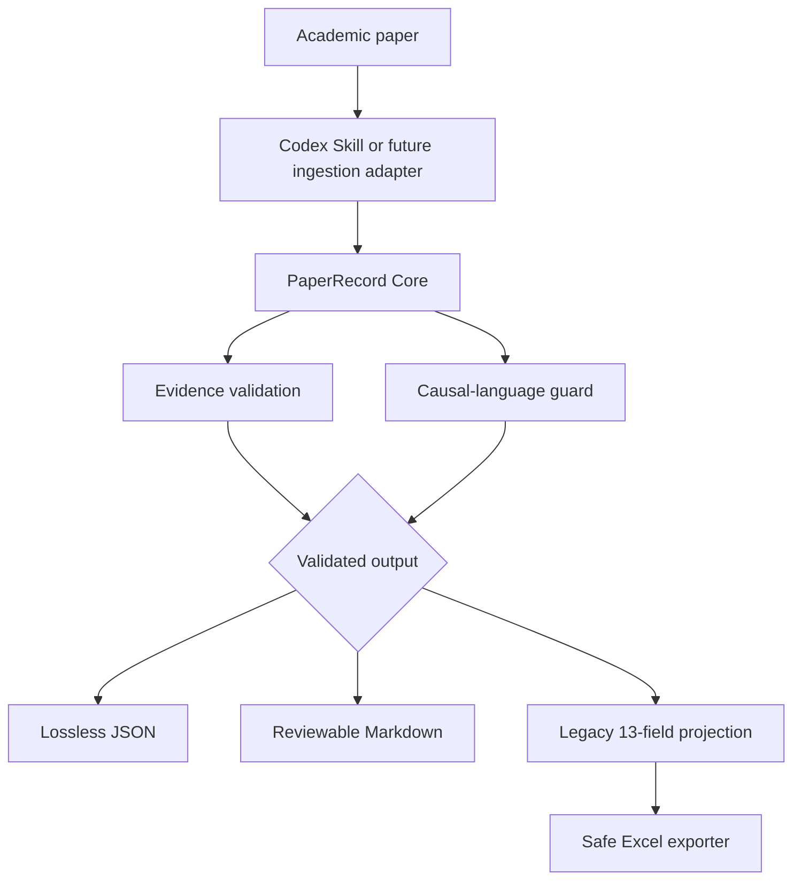

# PaperReading

**Evidence-Grounded AI Research Intelligence**

**English** | [简体中文](README.zh-CN.md)

[](https://github.com/AOROM/paperreading/actions/workflows/ci.yml)


PaperReading turns a paper into a strict, reviewable research object in which source claims, reported evidence, and researcher assessment remain separate. The Core validates evidence provenance and causal language, then exports the same record to JSON, Markdown, or a backward-compatible Excel workflow.

> Current scope: v0.2 is a Core architecture release. It accepts structured `PaperRecord` JSON created by the Codex Skill or another adapter. The Core does not yet parse arbitrary PDFs or call an AI provider by itself; those capabilities remain on the roadmap.

## Why this project

Fast summarization is not enough for research. A usable workflow must also answer:

- Which statement comes from the paper, and which is interpretation?
- Which page, section, table, figure, or equation supports a finding?
- Does the identification design justify causal language?
- Can the result be reused without collapsing it into one prose summary?
- Can it enter an existing workbook without damaging the source file?

PaperReading makes those questions machine-checkable workflow constraints.

## Implemented in v0.2

| Capability | Status | Contract |
|---|---|---|
| Paper Intelligence Schema | Implemented | Strict Pydantic `PaperRecord`; unknown fields fail validation |
| Evidence grounding | Implemented | Claims, findings, mechanisms, and tests bind to `EvidenceRef` objects |
| Confidence model | Implemented | Confidence is recalculated from locator specificity, not accepted as model opinion |
| Causal-language guard | Implemented | Unsupported causal wording produces a warning or validation error |
| Legacy 13-field output | Implemented | Generated through a projection; it is no longer the Core model |
| Exporters | Implemented | JSON, Markdown, and safe Excel append |
| CLI and Python API | Implemented | One Core shared by the CLI and Codex Skill adapter |
| PDF parsing, batch library, synthesis, gaps | Planned | Tracked explicitly in the [roadmap](ROADMAP.md) |

## Architecture



The dependency direction is deliberate:

```text
domain <- validation / projections <- CLI / Skill / exporters
```

The domain layer does not import Typer, OpenPyXL, a model SDK, or Codex. Excel exists only in its exporter; the Skill is an interface to the same Core.

## Quick start

PaperReading is currently installed from source:

```bash
git clone https://github.com/AOROM/paperreading.git
cd paperreading
python -m pip install -e ".[excel]"
```

Validate the synthetic example:

```bash
paperreading validate examples/paper-record.example.json
paperreading validate examples/paper-record.example.json --strict
```

Review the backward-compatible 13-field projection:

```bash
paperreading project examples/paper-record.example.json
```

Export reviewable artifacts:

```bash
paperreading export examples/paper-record.example.json review.md --format markdown
paperreading export examples/paper-record.example.json record.json --format json
```

Initialize a local research workspace without creating a database:

```bash
paperreading init
```

This creates `.paperreading/config.toml` and `.paperreading/papers/`. SQLite, batch ingestion, and search are not presented as implemented features in v0.2.

## The canonical record

The original Excel columns are no longer the internal model:

```text
PaperRecord
├── metadata
├── research_questions
├── theoretical_framework
├── data and variables
├── empirical_design
├── source_claims -> EvidenceRef[]
├── findings -> EvidenceRef[]
├── mechanisms / heterogeneity / robustness
├── limitations
├── extensions
└── researcher_assessment
```

An evidence reference can identify text, metadata, a table, figure, equation, or appendix:

```json
{
  "source_id": "paper-id-or-doi",
  "type": "TABLE",
  "page": 12,
  "section": "4.2 Baseline Results",
  "table": "Table 3",
  "column": "(4)"
}
```

The committed machine contracts are [`paper.schema.json`](schemas/paper.schema.json) and [`evidence.schema.json`](schemas/evidence.schema.json). See the synthetic [`paper-record.example.json`](examples/paper-record.example.json) for a complete record.

The confidence value measures **traceability specificity**, not whether a statement is true, a coefficient is correctly estimated, or a study is externally valid. In v0.2, the Core can validate the structure of a locator but cannot independently prove that the locator matches an unseen source document.

## Python API

```python
from pathlib import Path

from paperreading import PaperRecord, to_legacy_13_fields, validate_record

record = PaperRecord.model_validate_json(
    Path("record.json").read_text(encoding="utf-8")
)
report = validate_record(record, strict=True)

if report.valid:
    legacy_row = to_legacy_13_fields(record)
```

This API validates and transforms structured records. A future `PaperReader` that performs PDF ingestion is intentionally not advertised before it exists.

## Safe Excel compatibility

Append one validated record to an existing compatible workbook:

```bash
paperreading export record.json literature.xlsx --format excel --sheet 中文
```

The workbook must already contain `中文` and `英文` worksheets. The exporter retains the existing safeguards:

- validate the 12- or 13-column header contract;
- detect duplicates without overwriting them;
- preserve existing values, formulas, styles, tables, filters, and frozen panes;
- create a timestamped backup;
- save to a temporary file and reopen it for validation; and
- replace the source workbook atomically only after validation succeeds.

The legacy command remains available for existing integrations:

```bash
python skills/papers-reading-skill/scripts/append_paper_reading.py \
  --workbook literature.xlsx \
  --sheet 中文 \
  --data-json examples/paper-reading.example.json
```

The public repository contains no personal workbook path. When the compatibility command omits `--workbook`, it can still use `PAPER_READING_WORKBOOK`.

## Codex Skill

Copy `skills/papers-reading-skill` into the Codex skills directory after installing the Core package. Start a new Codex session and invoke `$papers-reading-skill`.

The Skill now acts as an adapter: it constructs a `PaperRecord`, runs the CLI validator, interprets warnings, and requests permission before any workbook mutation. Detailed runtime contracts are loaded progressively from its references.

## Project structure

```text
paperreading/
├── src/paperreading/
│   ├── domain/          # PaperRecord and EvidenceRef
│   ├── validation/      # Evidence and causal-language checks
│   ├── projections/     # Legacy 13-field projection
│   ├── exporters/       # JSON, Markdown, and Excel adapters
│   └── cli.py
├── schemas/             # Public JSON Schemas
├── skills/              # Codex adapter
├── examples/            # Synthetic records only
├── tests/               # Core, contract, CLI, and Excel safety tests
└── tools/               # Skill and schema validation
```

## Development

```bash
python -m pip install -e ".[excel,dev]"
python -m ruff check .
python -m ruff format --check .
python -m mypy
python tools/export_schemas.py --check
python tools/validate_skill.py skills/papers-reading-skill
python -m unittest discover -s tests -v
python -m pip wheel --no-deps --wheel-dir dist .
```

Read [CONTRIBUTING.md](CONTRIBUTING.md) for architecture and compatibility rules. Version sequencing and explicitly deferred capabilities are documented in [ROADMAP.md](ROADMAP.md).

## License

This repository currently has no open-source license. Public visibility does not automatically grant permission to copy, modify, or distribute its contents.
