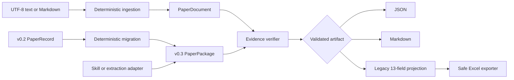

# PaperReading

**Evidence-grounded AI research workflow**

**English** | [简体中文](README.zh-CN.md)

[](https://github.com/AOROM/paperreading/actions/workflows/ci.yml)


PaperReading turns research material into versioned, reviewable artifacts. It keeps statements grounded in source locations, separates paper-reported facts from researcher analysis, checks whether evidence can be resolved against an ingested document, and preserves the existing 13-field Excel workflow.

> Current boundary: v0.3 ingests UTF-8 text and Markdown, migrates v0.2 records, normalizes evidence by stable ID, and verifies text locators and quotations. It does **not** yet parse PDFs, call an AI provider, run batch jobs, search a SQLite library, synthesize multiple papers, or discover research gaps automatically.

## Why PaperReading

A fluent summary is not the same as a defensible research asset. A reliable workflow must retain enough structure to answer:

- Which statements are reported by the paper, and which are later interpretation?
- Which page, section, block, table, figure, equation, or quotation supports a claim?
- Was a locator actually checked against the supplied source?
- Does the empirical design justify causal wording?
- Can an artifact evolve without silently breaking earlier records or Excel workflows?

PaperReading turns these questions into explicit schemas, validation rules, migration paths, and failure behavior.

## Research constitution

The normative [Research Principles](RESEARCH_PRINCIPLES.md) derive the project's decision rules from academic validity, traceability, falsifiability, reproducibility, and research ethics. They take precedence over compatibility, convenience, performance, and growth metrics. A capability that cannot state its research object, evidence, inference boundary, uncertainty, and failure behavior is not ready to ship.

## What is implemented

| Capability | Status | Public contract |
|---|---|---|
| v0.3 research package | Implemented | `PaperPackage` separates document, grounded record, normalized evidence, analysis, audit, and run metadata |
| Source-aware ingestion | Implemented | Deterministic UTF-8 `.txt`, `.md`, and `.markdown` parsing into `PaperDocument` blocks |
| Evidence graph | Implemented | Research objects reference de-duplicated `EvidenceSpan` nodes by stable ID |
| Evidence verification | Implemented | Source, page, block, section, quotation, and text-hash checks with explicit `verified`, `partial`, or `failed` status |
| v0.2 migration | Implemented | Deterministic `PaperRecord` → `PaperPackage` migration with visible provenance limitations |
| Analysis separation | Implemented | Researcher assessments and extensions live outside the source-grounded record |
| Causal-language guard | Implemented | Causal wording requires an eligible design and an explicit identification strategy |
| Export and compatibility | Implemented | Lossless JSON, reviewable Markdown, legacy 13-field projection, and safe Excel append |
| Local project storage | Implemented | Atomic, inspectable JSON files under `.paperreading/`; no database required |
| PDF/provider/batch/search/synthesis/gaps | Planned | Sequenced in the [roadmap](ROADMAP.md) and never presented as shipped |

## Architecture



The dependency direction is deliberate:

```text
domain <- migrations / ingestion / verification / validation / projections
       <- application use cases <- CLI / Skill / exporters / repositories
```

The domain layer imports no Typer, OpenPyXL, model SDK, storage adapter, or Codex runtime. File storage and Excel are replaceable adapters; the schemas remain the center of the system.

## Quick start

Install from source:

```bash
git clone https://github.com/AOROM/paperreading.git
cd paperreading
python -m pip install -e ".[excel]"
```

Initialize an inspectable local project:

```bash
paperreading init
```

This creates `.paperreading/config.toml`, a manifest, and separate directories for documents, drafts, records, analyses, audits, and cache data.

Ingest the synthetic Markdown source:

```bash
paperreading ingest examples/source.example.md
```

Migrate the synthetic v0.2 record without mutating the project:

```bash
paperreading migrate examples/paper-record.example.json \
  --output paper-package.json
```

Validate and export either version:

```bash
paperreading validate examples/paper-record.example.json
paperreading validate examples/paper-package.example.json
paperreading export examples/paper-package.example.json review.md --format markdown
paperreading project examples/paper-package.example.json
```

Verify a package whose evidence IDs reference an ingested document:

```bash
paperreading verify package.json \
  --document .paperreading/documents/<document-id>.json \
  --strict \
  --output verified-package.json
```

In v0.3, a Skill or another extraction adapter constructs that source-linked package. PaperReading itself does not yet infer a complete research record from arbitrary prose.

## The v0.3 artifact model

```text
PaperPackage
├── document: DocumentManifest
├── record: GroundedPaperRecord
│   ├── metadata / questions / theory / data / variables / design
│   ├── source_claims -> evidence_ids[]
│   ├── findings / mechanisms / heterogeneity / robustness -> evidence_ids[]
│   └── paper-reported limitations
├── evidence_index: {evidence_id -> EvidenceSpan}
├── analysis
│   ├── researcher or AI-assisted assessments
│   └── executable research extensions
├── audit: optional method-audit report
└── run: reproducibility metadata
```

`GroundedPaperRecord` contains source-derived information. `ResearchAnalysis` contains interpretation and proposed extensions. Keeping them separate prevents a generated idea from being mistaken for a paper finding.

An evidence span can include both logical and physical locators:

```json
{
  "evidence_id": "ev-0123456789abcdef",
  "source_id": "src-0123456789abcdef",
  "type": "TEXT",
  "page": 1,
  "section_path": ["Results"],
  "block_id": "p1-b0007",
  "char_start": 420,
  "char_end": 581,
  "quoted_text": "A source quotation used for verification."
}
```

The traceability score measures locator specificity. It is **not** a truth probability, study-quality score, causal-validity score, or external-validity judgment. Verification checks whether the locator and quotation resolve against the supplied `PaperDocument`; it still cannot establish that the paper's methods or claims are correct.

## Schemas and compatibility

The root schema names remain convenient stable aliases. Immutable versioned contracts live under [`schemas/v0.2`](schemas/v0.2) and [`schemas/v0.3`](schemas/v0.3).

| Input | Validate | JSON/Markdown | Legacy projection | Safe Excel |
|---|---:|---:|---:|---:|
| v0.2 `PaperRecord` | Yes | Yes | Yes | Yes |
| v0.3 `PaperPackage` | Yes | Yes | Yes, when research extensions exist | Yes, through the same projection |

Migration preserves the v0.2 13-field projection exactly. It does not pretend that legacy evidence has been checked against source content; migrated packages remain visibly marked `migrated` until verification runs.

## Python API

```python
from datetime import datetime, timezone
from pathlib import Path

from paperreading import (
    PaperRecord,
    migrate_v02_to_v03,
    to_legacy_13_fields,
    validate_package,
)

record = PaperRecord.model_validate_json(
    Path("record.json").read_text(encoding="utf-8")
)
package = migrate_v02_to_v03(
    record,
    migrated_at=datetime.now(timezone.utc),
)
report = validate_package(package)

if report.valid:
    legacy_row = to_legacy_13_fields(package)
```

## Safe Excel compatibility

```bash
paperreading export package.json literature.xlsx --format excel --sheet 中文
```

The workbook must already contain `中文` and `英文` worksheets. The exporter:

- validates the 12- or 13-column header contract;
- detects duplicates without overwriting them;
- preserves existing values, formulas, styles, tables, filters, and frozen panes;
- creates a timestamped backup;
- writes and reopens a temporary file for validation; and
- replaces the source workbook atomically only after validation succeeds.

The legacy `skills/papers-reading-skill/scripts/append_paper_reading.py` entry point remains available for existing 13-field JSON integrations. No personal workbook path is committed; `PAPER_READING_WORKBOOK` may supply an existing local configuration.

## Codex Skill

Copy [`skills/papers-reading-skill`](skills/papers-reading-skill) into the Codex skills directory after installing the Core package, start a new session, and invoke `$papers-reading-skill`.

The Skill is an adapter, not a second implementation. It respects the supplied source boundary, constructs a source-grounded package or compatible v0.2 record, runs Core validation, reports uncertainty, and requests authorization before workbook mutation.

## Project structure

```text
paperreading/
├── RESEARCH_PRINCIPLES*.md # Bilingual academic-research contract
├── src/paperreading/
│   ├── domain/          # v0.2 and v0.3 strict models
│   ├── ingestion/       # deterministic text/Markdown parser
│   ├── migrations/      # version-to-version transformations
│   ├── verification/    # source-content evidence checks
│   ├── validation/      # evidence-state and causal-language rules
│   ├── application/     # reusable use cases
│   ├── repositories/    # local atomic JSON adapter
│   ├── projections/     # legacy 13-field projection
│   └── exporters/       # JSON, Markdown, and Excel adapters
├── schemas/             # root aliases and versioned JSON Schemas
├── skills/              # Codex adapter
├── examples/            # synthetic, non-citable fixtures
├── tests/               # domain, CLI, migration, verifier, and Excel safety tests
└── tools/               # deterministic schema, example, and Skill checks
```

## Development

```bash
python -m pip install -e ".[excel,dev]"
python -m ruff check .
python -m ruff format --check .
python -m mypy
python tools/export_schemas.py --check
python tools/generate_examples.py --check
python tools/validate_skill.py skills/papers-reading-skill
python -m unittest discover -s tests -v
python -m pip wheel --no-deps --wheel-dir dist .
```

See [CONTRIBUTING.md](CONTRIBUTING.md) for architecture, schema-evolution, compatibility, and data-safety rules. See [ROADMAP.md](ROADMAP.md) for the boundary between shipped behavior and planned hypotheses. Security reports follow [SECURITY.md](SECURITY.md).

## License

This repository currently has no open-source license. Public visibility does not automatically grant permission to copy, modify, or distribute its contents.
