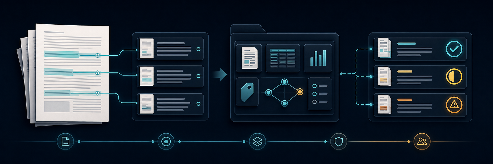
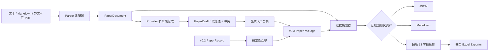

<h1 align="center">PaperReading</h1>

<p align="center">
  
</p>

<div align="center">
  <p><strong>证据约束的 AI 研究工作流</strong></p>
  <p>
    将研究材料转化为可版本化、可复核的研究资产。<br>
    让主张指向证据，让报告与分析分离，让不确定性保持可见。
  </p>
  <p>
    <a href="https://github.com/AOROM/paperreading/actions/workflows/ci.yml"></a>
    
    
    <a href="LICENSE"></a>
    <a href="https://github.com/AOROM/paperreading/stargazers"></a>
  </p>
  <p><a href="README.md">English</a> · <strong>简体中文</strong></p>
  <p>
    <a href="#quick-start">快速开始</a> ·
    <a href="#capabilities">能力边界</a> ·
    <a href="#architecture">工作原理</a> ·
    <a href="RESEARCH_PRINCIPLES.zh-CN.md">研究原则</a> ·
    <a href="ROADMAP.zh-CN.md">路线图</a> ·
    <a href="CONTRIBUTING.zh-CN.md">参与贡献</a>
  </p>
</div>

PaperReading 是一个处于 Alpha 阶段的 Python Core 与 Codex Skill，面向不满足于“流畅摘要”的研究者和研究工具开发者。它通过 Schema 与校验器保留从来源位置到研究主张的链路，区分论文报告内容与后续分析，约束因果语言，并让旧有研究导出继续保持可复核。

> [!IMPORTANT]
> **当前范围：**v0.3.1 支持 UTF-8 文本、Markdown 与带文本层 PDF 的摄取；可通过可审计 JSON Provider 重放多阶段提取；强制执行 Draft → Review → Finalize；并使用局部模糊对齐核验引文。PDF 能力**不包含** OCR、版面几何、表格重建或图形提取。托管 AI Provider、批处理、SQLite 搜索、跨论文综合与自动 Gap 发现仍处于规划阶段。

## 从流畅摘要到可辩护的研究资产

| 学术研究要求 | PaperReading 的规则 |
|---|---|
| 可追溯 | 主张引用去重后的证据片段，并保留来源与位置元数据 |
| 认识论分离 | 论文报告内容与研究者或 AI 辅助分析存放在不同对象中 |
| 推断纪律 | 因果表述必须具备合格研究设计与明确识别策略 |
| 显式不确定性 | 核验返回 `verified`、`partial` 或 `failed`；迁移不冒充来源核对 |
| 可复现 | 版本化 Schema、运行元数据、确定性迁移与可检查本地文件共同保留溯源 |
| 向后兼容 | JSON、Markdown、旧版 13 字段投影与安全 Excel 追加共享同一套已校验领域模型 |

这些规则使五个问题可以被回答：论文报告了什么、证据位于哪里、位置是否经过核对、研究设计允许何种推断，以及研究资产如何随时间变化。

<a id="quick-start"></a>

## 60 秒快速体验

克隆仓库、安装 Core 包，并校验仓库内置的研究包：

```bash
git clone https://github.com/AOROM/paperreading.git
cd paperreading
python -m pip install -e .
paperreading validate examples/paper-package.example.json
```

该示例会返回 `valid: true`、`evidence_count: 4` 与 `finding_count: 1`，同时明确给出 4 条 `EVIDENCE_NOT_VERIFIED` 警告，因为示例由 v0.2 迁移而来，尚未与来源正文核对。这个可见的局限属于研究契约，而不是应被隐藏的噪声。

| 如果你希望…… | 建议从这里开始 |
|---|---|
| 评估研究资产模型 | [`examples/paper-package.example.json`](examples/paper-package.example.json) 与[版本化 Schema](schemas/v0.3) |
| 使用 Codex 工作流 | [`skills/papers-reading-skill`](skills/papers-reading-skill) |
| 从 Python 集成 | [Python API](#python-api) |
| 保留既有 Excel 工作流 | [安全 Excel 兼容](#安全-excel-兼容) |
| 理解研究安全边界 | [《学术研究底层逻辑》](RESEARCH_PRINCIPLES.zh-CN.md) |
| 参与项目建设 | [路线图](ROADMAP.zh-CN.md)与[贡献指南](CONTRIBUTING.zh-CN.md) |

<a id="capabilities"></a>

## v0.3.1 已交付能力

| 能力 | 状态 | 公开契约 |
|---|---|---|
| v0.3 研究包 | 已实现 | `PaperPackage` 分离文档、来源记录、规范化证据、分析、审计与运行元数据 |
| 来源感知摄取 | 已实现 | 通过统一 `DocumentParser` Port 确定性解析 UTF-8 文本、Markdown 与可选的带文本层 PDF |
| 提取生命周期 | 已实现 | Provider 中立的多阶段提取、Candidate / Conflict 保留、显式人工复核和受控定稿 |
| 离线 JSON Provider | 已实现 | 无网络调用、无隐藏模型依赖地重放可检查的候选值与证据输出 |
| 证据图 | 已实现 | 研究对象通过稳定 ID 引用去重后的 `EvidenceSpan` 节点 |
| 证据核验 v2 | 已实现 | 核验来源、页码、文本块、章节、文本哈希与局部窗口模糊引文，并返回显式状态 |
| v0.2 迁移 | 已实现 | 确定性地将 `PaperRecord` 迁移为 `PaperPackage`，同时显式保留溯源局限 |
| 分析分离 | 已实现 | 研究者判断和研究拓展位于来源记录之外 |
| 因果语言守卫 | 已实现 | 因果表述要求合格设计和明确识别策略 |
| 导出与兼容 | 已实现 | 无损 JSON、可复核 Markdown、旧版 13 字段投影与安全 Excel 追加 |
| 本地项目存储 | 已实现 | `.paperreading/` 下的原子化、可检查 JSON 文件，无需数据库 |
| OCR / 托管 LLM / PDF 几何 / 批处理 / 搜索 / 综合 | 规划中 | 按[路线图](ROADMAP.zh-CN.md)排序，绝不描述为已经交付 |

<a id="architecture"></a>

## 工作原理



依赖方向是明确的：

```text
domain <- migrations / ingestion / verification / validation / projections
       <- application use cases <- CLI / Skill / exporters / repositories
```

Domain 层不导入 Typer、OpenPyXL、模型 SDK、存储适配器或 Codex Runtime。文件存储和 Excel 都是可替换适配器，Schema 才是系统中心。

## 研究宪章

规范性文档[《学术研究底层逻辑》](RESEARCH_PRINCIPLES.zh-CN.md)从学术有效性、可追溯性、可证伪性、可复现性和研究伦理出发推导项目决策规则。其优先级高于兼容性、便利性、性能和增长指标。无法说明研究对象、证据、推断边界、不确定性和失败行为的能力，不得作为正式功能交付。

## 探索命令工作流

只有需要 PDF 或 Excel 适配器时才安装对应可选依赖：

```bash
python -m pip install -e ".[pdf,excel]"
```

初始化一个可检查的本地项目：

```bash
paperreading init
```

该命令会创建 `.paperreading/config.toml`、清单文件，以及彼此独立的 documents、drafts、records、analyses、audits 和 cache 目录。

使用合成 Markdown 示例测试来源摄取契约：

```bash
paperreading ingest examples/source.example.md
```

运行完整且无网络依赖的 Draft → Review → Finalize 示例：

```bash
paperreading ingest examples/source.example.md --output document.json
paperreading extract document.json \
  --provider-manifest examples/extraction-manifest.example.json \
  --output bundle.json
paperreading review bundle.json \
  --decisions examples/review-decisions.example.json \
  --output reviewed.json
paperreading finalize reviewed.json \
  --document document.json \
  --output package.json
paperreading verify package.json --document document.json --strict
```

需要项目 Repository 时，`paperreading read` 会合并摄取与提取。JSON Provider 是面向评估和集成的确定性重放适配器，并非托管 LLM。未来模型适配器必须实现同一 Provider 契约，并保留候选证据、不确定性与运行元数据。

在不修改项目的情况下测试确定性的 v0.2 迁移：

```bash
paperreading migrate examples/paper-record.example.json \
  --output paper-package.json
```

校验、导出并投影任一版本：

```bash
paperreading validate examples/paper-record.example.json
paperreading validate examples/paper-package.example.json
paperreading export examples/paper-package.example.json review.md --format markdown
paperreading project examples/paper-package.example.json
```

核验证据 ID 已引用某个摄取文档的研究包：

```bash
paperreading verify package.json \
  --document .paperreading/documents/<document-id>.json \
  --strict \
  --output verified-package.json
```

提取示例与合成 Markdown 来源相互关联，可以端到端通过严格核验；其中材料完全虚构，不可引用。对任意论文进行提取仍需要兼容 Provider；PaperReading 不会静默调用模型，也不会声称具备 OCR 能力。

## v0.3 研究资产模型

```text
PaperPackage
├── document: DocumentManifest
├── record: GroundedPaperRecord
│   ├── metadata / questions / theory / data / variables / design
│   ├── source_claims -> evidence_ids[]
│   ├── findings / mechanisms / heterogeneity / robustness -> evidence_ids[]
│   └── 论文报告的局限
├── evidence_index: {evidence_id -> EvidenceSpan}
├── analysis
│   ├── 研究者或 AI 辅助判断
│   └── 可执行研究拓展
├── audit: 可选的方法审计报告
└── run: 可复现性元数据
```

`GroundedPaperRecord` 只包含来源派生信息；`ResearchAnalysis` 包含解释和拟议拓展。二者分离可以防止生成的研究想法被误认为论文发现。

EvidenceSpan 可以同时记录逻辑位置与物理位置：

```json
{
  "evidence_id": "ev-0123456789abcdef",
  "source_id": "src-0123456789abcdef",
  "type": "TEXT",
  "page": 1,
  "section_path": ["Results"],
  "block_id": "p1-b0007",
  "char_start": 420,
  "char_end": 581,
  "quoted_text": "A source quotation used for verification."
}
```

可追溯性分数衡量来源位置的具体程度。它**不是**真实性概率、研究质量分数、因果有效性分数或外部效度判断。证据核验只能确认来源位置和引文能否在给定 `PaperDocument` 中解析，仍不能证明论文方法或主张本身正确。

## Schema 与兼容性

根目录 Schema 名称继续作为便捷稳定别名；不可变的版本化契约位于 [`schemas/v0.2`](schemas/v0.2) 与 [`schemas/v0.3`](schemas/v0.3)。

| 输入 | 校验 | JSON / Markdown | 旧版投影 | 安全 Excel |
|---|---:|---:|---:|---:|
| v0.2 `PaperRecord` | 是 | 是 | 是 | 是 |
| v0.3 `PaperPackage` | 是 | 是 | 是，前提是存在研究拓展 | 是，通过同一投影层 |

迁移会完整保持 v0.2 的 13 字段投影，但不会假装旧版证据已与来源正文核对。迁移包会持续明确标记为 `migrated`，直到完成核验。

## Python API

```python
from datetime import datetime, timezone
from pathlib import Path

from paperreading import (
    PaperRecord,
    migrate_v02_to_v03,
    to_legacy_13_fields,
    validate_package,
)

record = PaperRecord.model_validate_json(
    Path("record.json").read_text(encoding="utf-8")
)
package = migrate_v02_to_v03(
    record,
    migrated_at=datetime.now(timezone.utc),
)
report = validate_package(package)

if report.valid:
    legacy_row = to_legacy_13_fields(package)
```

## 安全 Excel 兼容

```bash
paperreading export package.json literature.xlsx --format excel --sheet 中文
```

工作簿必须已经包含 `中文` 和 `英文` 工作表。Exporter 会：

- 校验 12 列或 13 列表头契约；
- 检测重复记录且不执行覆盖；
- 保留既有数值、公式、样式、表格、筛选和冻结窗格；
- 创建带时间戳的备份；
- 写入临时文件并重新打开校验；
- 只有校验成功后才原子替换源工作簿。

旧版 `skills/papers-reading-skill/scripts/append_paper_reading.py` 入口仍可用于既有 13 字段 JSON 集成。仓库不提交个人工作簿路径；`PAPER_READING_WORKBOOK` 可提供既有本地配置。

## Codex Skill

安装 Core 后，将 [`skills/papers-reading-skill`](skills/papers-reading-skill) 复制到 Codex skills 目录，开启新会话并调用 `$papers-reading-skill`。可独立分发的 Skill 目录携带相同的 MIT 许可声明。

Skill 是适配器，而不是第二套实现。它尊重用户提供的来源边界，构造来源约束的研究包或兼容 v0.2 记录，运行 Core 校验，报告不确定性，并在修改工作簿前请求授权。

## 文档导航

| 文档 | 用途 |
|---|---|
| [《学术研究底层逻辑》](RESEARCH_PRINCIPLES.zh-CN.md) | 有效性、证据、推断、不确定性、可复现性与伦理的规范性规则 |
| [架构说明](docs/architecture.zh-CN.md) | Parser / Provider Port、研究资产生命周期、身份规则与定稿守卫 |
| [路线图](ROADMAP.zh-CN.md) | 已交付边界、规划假说、里程碑与发布门禁 |
| [贡献指南](CONTRIBUTING.zh-CN.md) | 架构、Schema 演进、兼容性、测试与研究诚信检查 |
| [安全策略](SECURITY.md) | 漏洞私密报告方式与受支持版本策略 |
| [变更日志](CHANGELOG.md) | 公开能力与兼容性变化的版本化记录 |
| [MIT 许可证](LICENSE) | 使用、复制、修改、分发、再许可和销售本项目的授权条件 |

## 项目结构

```text
paperreading/
├── LICENSE                 # OSI 认可的 MIT 开源许可证
├── RESEARCH_PRINCIPLES*.md # 中英文规范性学术研究契约
├── docs/assets/            # 仓库展示资产及其溯源说明
├── src/paperreading/
│   ├── domain/          # v0.2 与 v0.3 严格模型
│   ├── ingestion/       # 文本、Markdown 与可选带文本层 PDF 解析器
│   ├── providers/       # 提取协议与离线 JSON 适配器
│   ├── migrations/      # 版本间转换
│   ├── verification/    # 来源正文证据检查
│   ├── validation/      # 证据状态与因果语言规则
│   ├── application/     # 可复用用例
│   ├── repositories/    # 本地原子 JSON 适配器
│   ├── projections/     # 旧版 13 字段投影
│   └── exporters/       # JSON、Markdown 与 Excel 适配器
├── schemas/             # 根别名与版本化 JSON Schema
├── skills/              # Codex 适配器
├── examples/            # 合成、不可引用的示例
├── tests/               # Domain、CLI、迁移、核验与 Excel 安全测试
└── tools/               # 确定性 Schema、示例与 Skill 检查
```

## 开发

```bash
python -m pip install -e ".[excel,pdf,dev]"
python -m ruff check .
python -m ruff format --check .
python -m mypy
python tools/export_schemas.py --check
python tools/generate_examples.py --check
python tools/validate_skill.py skills/papers-reading-skill
python tools/validate_license.py
python -m unittest discover -s tests -v
python -m pip wheel --no-deps --wheel-dir dist .
python tools/validate_license.py --wheel-dir dist
```

如果这一方向对你的研究工作流有价值，欢迎为[仓库加星](https://github.com/AOROM/paperreading)、提交包含可复现案例的 Issue，或按照[中文贡献指南](CONTRIBUTING.zh-CN.md)参与建设。

## 许可

PaperReading 是依据 [MIT 许可证](LICENSE)发布的开源软件。除非文件另有声明，该许可证覆盖仓库中的源代码、Schema、合成示例、文档与展示资产。

MIT 许可证不授予第三方论文、数据集、用户提供输入或生成摘录的权利；这些材料仍受其自身版权、隐私、保密、同意与再分发条款约束。
