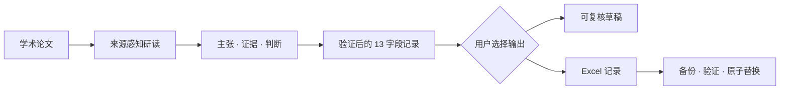

# Paper Reading Skill

**Evidence-grounded AI research workflow｜证据驱动的 AI 研究工作流**

[English](README.md) | **简体中文**

[](https://github.com/AOROM/paperreading/actions/workflows/ci.yml)

将学术论文转化为结构化、可复核的研究记录。Paper Reading Skill 区分来源主张、报告证据与研究者判断，保留不确定性而不补造缺失事实，提出可执行的后续研究设计，并可把验证后的结果安全写入既有 Excel 文献研读表。

## 为什么需要这个项目

AI 可以快速概括论文，但可用于研究的工作流还必须回答：

- 哪些陈述来自论文，哪些属于研究者解释？
- 每项报告结论由什么证据支持？
- 识别策略是否足以支持因果表述？
- 哪些信息缺失或仍未确认？
- 结果能否在不损坏原文件的情况下进入既有研究系统？

本项目把这些问题视为工作流约束，而不是可选的写作风格。

## 工作流



## 设计原则

- **证据先于解释**：区分论文明确陈述、实证结果实际显示的内容，以及研读者据此作出的判断。
- **未知信息保持未知**：不得为填补空白而补造模型、变量、检验、来源、期刊等级或因果结论。
- **因果表述服从识别设计**：除非研究设计足以支持因果解释，否则只能表述为相关关系。
- **结构化结果仍可复核**：每篇论文遵守相同的 13 字段契约，同时保留零结果和研究局限。
- **自动化必须可逆**：写入前验证和查重，创建备份，并以原子方式替换工作簿。
- **文件修改由用户控制**：除非用户明确提供或配置工作簿路径，否则只生成草稿。

## 输出内容

工作流按固定顺序生成以下字段：

`序号` · `论文名称` · `作者` · `期刊` · `期刊等级` · `发表时间` · `关键词` · `研究问题` · `研究结论` · `研究逻辑` · `实证模型` · `数据来源和变量设置` · `可进一步延伸的研究设计`

它可以：

- 分层整理基准结论、作用机制、异质性、经济后果、内生性处理与稳健性检验；
- 在论文页码或章节信息可用时，将来源位置保留在研读说明中；
- 针对具体论文提出两至四项包含识别策略或数据方案的可执行延伸设计；
- 仅生成草稿，不接触工作簿；或
- 为兼容的 12 列工作簿安全补充第 13 列，并写入经过验证的新记录。

## 快速开始

1. 克隆仓库并安装确定性写入脚本的依赖：

   ```bash
   git clone https://github.com/AOROM/paperreading.git
   cd paperreading
   python -m pip install -r requirements.txt
   ```

2. 将 Skill 复制到 Codex skills 目录。Windows PowerShell 示例：

   ```powershell
   Copy-Item -Recurse -Force `
     .\skills\papers-reading-skill `
     "$env:USERPROFILE\.codex\skills\papers-reading-skill"
   ```

3. 重新打开 Codex 会话并调用 `$papers-reading-skill`。

生成可复核草稿：

```text
使用 $papers-reading-skill 将这篇论文整理为 13 个证据驱动字段，区分来源主张、报告证据与研究者判断，但不要写入工作簿。
```

仅在验证后写入：

```text
使用 $papers-reading-skill 研读这篇论文；验证全部 13 个字段后，将结果写入已配置工作簿的中文工作表。
```

## 安全工作簿自动化

公开仓库不包含任何个人工作簿路径。写入脚本按以下顺序解析目标文件：

1. 命令行提供的 `--workbook <path>`；
2. 环境变量 `PAPER_READING_WORKBOOK`；
3. 两者均不存在时停止，不执行写入。

PowerShell：

```powershell
$env:PAPER_READING_WORKBOOK = "D:\research\paper-reading.xlsx"
```

Bash：

```bash
export PAPER_READING_WORKBOOK="/data/research/paper-reading.xlsx"
```

直接调用确定性写入脚本：

```bash
python skills/papers-reading-skill/scripts/append_paper_reading.py \
  --workbook "/path/to/paper-reading.xlsx" \
  --sheet 中文 \
  --data-json examples/paper-reading.example.json
```

中文论文使用 `--sheet 中文`，英文论文使用 `--sheet 英文`。脚本以 JSON 返回 `paper_appended`、`duplicate_skipped`、`schema_updated` 或 `error`。发生验证或写入错误时，原工作簿保持不变。

## 证据和期刊等级边界

字段定义见 [`reading-fields.md`](skills/papers-reading-skill/references/reading-fields.md)。仅当所提供材料包含来源位置时才记录页码或章节；不得用虚构页码或引文替代缺失信息。

期刊等级属于具有版本边界的外部证据。只记录可靠来源确认的标签，保留来源体系的原始表述，不得在不同评价体系间推断或换算。涉及评价、职称、成果申报或投稿决策时，必须核实适用体系、版本与生效日期。

## 项目结构

```text
paperreading/
├── skills/papers-reading-skill/   # 可安装的运行时 Skill
│   ├── SKILL.md
│   ├── agents/openai.yaml
│   ├── references/
│   └── scripts/append_paper_reading.py
├── examples/                      # 合成示例输入
├── tests/                         # 安全与结构测试
├── tools/                         # 仓库级校验
└── .github/workflows/ci.yml       # 自动验证
```

仓库文档、测试和 CI 配置保留在运行时 Skill 之外，避免占用其上下文预算。

## 开发与验证

```bash
python -m pip install -r requirements-dev.txt
python tools/validate_skill.py skills/papers-reading-skill
python -m unittest discover -s tests -v
```

GitHub Actions 会验证 Skill 元数据，并测试工作簿升级、重复检测、配置解析和失败时保护源文件等行为。

提交变更前，请阅读[中文贡献指南](CONTRIBUTING.zh-CN.md)。

## 许可

本仓库目前未附加开源许可证。公开可见不等于自动授予复制、修改或分发权利。
