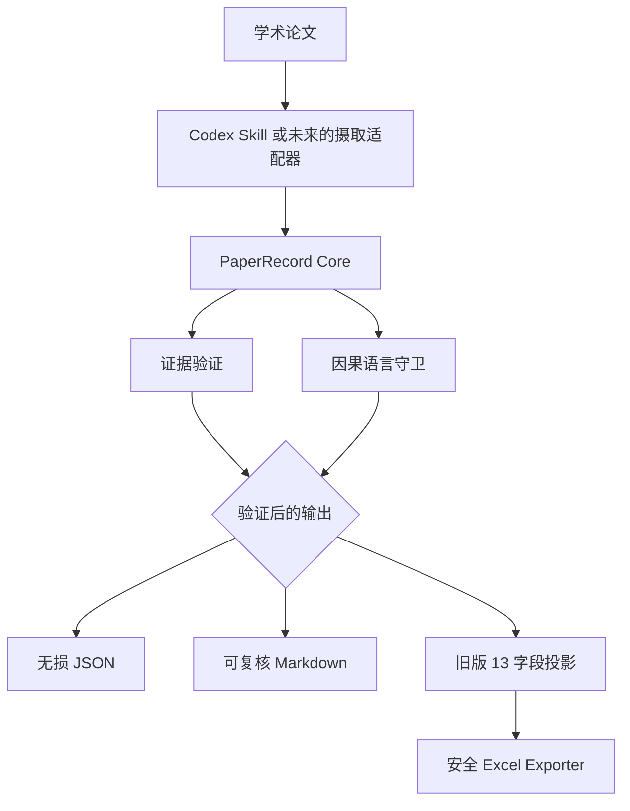

# PaperReading

**Evidence-Grounded AI Research Intelligence｜证据驱动的 AI 研究智能**

[English](README.md) | **简体中文**

[](https://github.com/AOROM/paperreading/actions/workflows/ci.yml)


PaperReading 将论文转化为严格且可复核的研究对象，并始终区分来源主张、报告证据与研究者判断。Core 负责验证证据来源和因果表述，再将同一条记录导出为 JSON、Markdown 或向后兼容的 Excel 工作流。

> 当前范围：v0.2 是 Core 架构版本。它接收由 Codex Skill 或其他适配器构造的 `PaperRecord` JSON。Core 目前不会自行解析任意 PDF，也不会自行调用 AI Provider；这些能力仍在路线图中。

## 为什么需要这个项目

快速摘要不足以支撑研究。可用的工作流还必须回答：

- 哪项陈述来自论文，哪项属于解释？
- 哪个页码、章节、表格、图形或方程支持某项发现？
- 识别设计是否足以支持因果表述？
- 结果能否在不退化为一段摘要的情况下继续复用？
- 结果能否进入既有工作簿而不损坏源文件？

PaperReading 把这些问题转化为可以由机器检查的工作流约束。

## v0.2 已实现能力

| 能力 | 状态 | 契约 |
|---|---|---|
| Paper Intelligence Schema | 已实现 | 严格的 Pydantic `PaperRecord`；未知字段会导致验证失败 |
| Evidence Grounding | 已实现 | 主张、发现、机制和检验均绑定 `EvidenceRef` |
| 置信度模型 | 已实现 | 根据来源位置的具体程度重新计算，不接受模型主观给分 |
| 因果语言守卫 | 已实现 | 缺乏识别支持的因果表述会产生警告或验证错误 |
| 旧版 13 字段输出 | 已实现 | 由投影层生成，不再是 Core 数据模型 |
| Exporter | 已实现 | JSON、Markdown 与安全 Excel 追加 |
| CLI 与 Python API | 已实现 | CLI 和 Codex Skill Adapter 共享同一个 Core |
| PDF 解析、批量文献库、综合与缺口发现 | 规划中 | 在[路线图](ROADMAP.zh-CN.md)中明确跟踪 |

## 架构



依赖方向是明确的：

```text
domain <- validation / projections <- CLI / Skill / exporters
```

Domain 层不导入 Typer、OpenPyXL、模型 SDK 或 Codex。Excel 只存在于对应的 Exporter；Skill 只是同一个 Core 的接口。

## 快速开始

PaperReading 当前从源码安装：

```bash
git clone https://github.com/AOROM/paperreading.git
cd paperreading
python -m pip install -e ".[excel]"
```

验证合成示例：

```bash
paperreading validate examples/paper-record.example.json
paperreading validate examples/paper-record.example.json --strict
```

查看向后兼容的 13 字段投影：

```bash
paperreading project examples/paper-record.example.json
```

导出可复核文件：

```bash
paperreading export examples/paper-record.example.json review.md --format markdown
paperreading export examples/paper-record.example.json record.json --format json
```

初始化一个不包含数据库的本地研究工作区：

```bash
paperreading init
```

该命令创建 `.paperreading/config.toml` 和 `.paperreading/papers/`。v0.2 不会把 SQLite、批量摄取或搜索描述成已经实现的功能。

## 规范化核心记录

原有 Excel 字段不再是内部模型：

```text
PaperRecord
├── metadata
├── research_questions
├── theoretical_framework
├── data and variables
├── empirical_design
├── source_claims -> EvidenceRef[]
├── findings -> EvidenceRef[]
├── mechanisms / heterogeneity / robustness
├── limitations
├── extensions
└── researcher_assessment
```

EvidenceRef 可以定位正文、元数据、表格、图形、方程或附录：

```json
{
  "source_id": "paper-id-or-doi",
  "type": "TABLE",
  "page": 12,
  "section": "4.2 Baseline Results",
  "table": "Table 3",
  "column": "(4)"
}
```

提交到仓库的机器契约为 [`paper.schema.json`](schemas/paper.schema.json) 和 [`evidence.schema.json`](schemas/evidence.schema.json)。完整记录结构见合成示例 [`paper-record.example.json`](examples/paper-record.example.json)。

置信度衡量的是**来源位置的可追溯具体程度**，不代表陈述为真的概率，也不代表系数估计正确或研究具有外部效度。v0.2 Core 可以验证来源位置的结构，但无法在未获得原始文档时独立证明该位置确实与文档内容一致。

## Python API

```python
from pathlib import Path

from paperreading import PaperRecord, to_legacy_13_fields, validate_record

record = PaperRecord.model_validate_json(
    Path("record.json").read_text(encoding="utf-8")
)
report = validate_record(record, strict=True)

if report.valid:
    legacy_row = to_legacy_13_fields(record)
```

该 API 用于验证和转换结构化记录。未来负责 PDF 摄取的 `PaperReader` 尚未实现，因此不会被提前宣传。

## 安全 Excel 兼容

向既有兼容工作簿追加一条验证后的记录：

```bash
paperreading export record.json literature.xlsx --format excel --sheet 中文
```

工作簿必须已经包含 `中文` 和 `英文` 工作表。Exporter 保留原有全部安全机制：

- 验证 12 列或 13 列表头契约；
- 检测重复论文且不执行覆盖；
- 保留既有数值、公式、样式、表格、筛选和冻结窗格；
- 创建带时间戳的备份；
- 先保存临时文件，再重新打开进行验证；
- 只有验证成功后才原子替换源工作簿。

既有集成仍可使用兼容命令：

```bash
python skills/papers-reading-skill/scripts/append_paper_reading.py \
  --workbook literature.xlsx \
  --sheet 中文 \
  --data-json examples/paper-reading.example.json
```

公开仓库不包含任何个人工作簿路径。兼容命令省略 `--workbook` 时，仍可使用 `PAPER_READING_WORKBOOK`。

## Codex Skill

安装 Core 包后，将 `skills/papers-reading-skill` 复制到 Codex skills 目录。重新打开 Codex 会话并调用 `$papers-reading-skill`。

Skill 现在只承担 Adapter 职责：构造 `PaperRecord`、运行 CLI 校验器、解释警告，并在修改工作簿前取得许可。详细运行契约通过 references 按需加载。

## 项目结构

```text
paperreading/
├── src/paperreading/
│   ├── domain/          # PaperRecord 与 EvidenceRef
│   ├── validation/      # 证据和因果语言检查
│   ├── projections/     # 旧版 13 字段投影
│   ├── exporters/       # JSON、Markdown 与 Excel 适配器
│   └── cli.py
├── schemas/             # 公开 JSON Schema
├── skills/              # Codex Adapter
├── examples/            # 仅包含合成记录
├── tests/               # Core、契约、CLI 与 Excel 安全测试
└── tools/               # Skill 和 Schema 校验
```

## 开发

```bash
python -m pip install -e ".[excel,dev]"
python -m ruff check .
python -m ruff format --check .
python -m mypy
python tools/export_schemas.py --check
python tools/validate_skill.py skills/papers-reading-skill
python -m unittest discover -s tests -v
python -m pip wheel --no-deps --wheel-dir dist .
```

架构和兼容规则见[中文贡献指南](CONTRIBUTING.zh-CN.md)。版本顺序和明确延期的能力见[中文路线图](ROADMAP.zh-CN.md)。

## 许可

本仓库目前未附加开源许可证。公开可见不等于自动授予复制、修改或分发权利。
