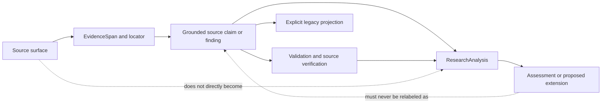

# PaperReading Research Principles

**English** | [简体中文](RESEARCH_PRINCIPLES.zh-CN.md)

- Status: normative project contract
- Applies to: Core models, ingestion, extraction adapters, validation, verification, analysis, exports, Skills, documentation, and future integrations

## Purpose

PaperReading is not primarily a summarization system. It is infrastructure for producing research artifacts that remain open to criticism, source inspection, and reconstruction after automation has occurred.

This document derives the project's non-negotiable logic from the minimum requirements of defensible academic work. It is a design contract, not a claim that software can determine scientific truth or replace expert review.

## First-principles derivation

1. Academic research advances through claims that other people can inspect, challenge, and revise.
2. A claim cannot be assessed without knowing its source evidence, inferential route, assumptions, and uncertainty.
3. An automated workflow is trustworthy only if it preserves those elements instead of replacing them with fluent prose or an unexplained score.
4. Therefore, PaperReading must optimize for epistemic integrity and auditability before speed, convenience, or engagement.

Legal authority, research ethics, privacy, consent, and source-licensing boundaries are hard constraints. Within those constraints, project decisions follow this priority order:

PaperReading's repository materials are released under the [MIT License](LICENSE). That license governs the project software and associated documentation; it does not create permission to reuse third-party papers, datasets, user inputs, or extracted content.

```text
epistemic integrity
  > auditability
  > reproducibility
  > interoperability and backward compatibility
  > convenience and performance
  > growth metrics
```

Compatibility, speed, automation coverage, or stars never justify weakening a higher-priority requirement.

## Non-negotiable principles

| ID | Rule | Required behavior | Forbidden shortcut |
|---|---|---|---|
| P1 | Preserve semantic boundaries | Keep source material, evidence spans, paper-reported claims, system assessment, and proposed research designs as different object types. | Mixing interpretation or generated ideas into a paper's reported findings. |
| P2 | Bind claims to inspectable evidence | Every source-grounded claim or reported result must resolve to evidence IDs and source locators. | Accepting unsupported prose because it sounds plausible. |
| P3 | Impose an inference ceiling | System-endorsed language must not be stronger than the design, identification strategy, and verified evidence support. | Converting association, fixed effects, or author rhetoric into an endorsed causal conclusion. |
| P4 | Preserve uncertainty and absence | Distinguish unknown, not reported, null result, not applicable, not run, partial, failed, and conflicting. Prefer abstention to fabrication. | Filling missing fields, silently dropping null results, or treating missing evidence as negative evidence. |
| P5 | Make status earned, not declared | `verified`, `audited`, and similar states may be produced only by the corresponding completed checks. | Letting a caller or model self-assign a lifecycle state or confidence value. |
| P6 | Make transformations reproducible | Record source identity and hash, schema and pipeline versions, configuration, prompts/providers when applicable, timestamps, and deterministic migrations. | Silently reinterpreting old artifacts or hiding nondeterministic inputs. |
| P7 | Design for falsification and review | Derived statements must expose supporting evidence, assumptions, caveats, and failure reports so a reviewer can reject them. | Returning only a final score, summary, or recommendation with no inspectable basis. |
| P8 | Preserve research validity and selection context | Retain variable definitions and measurements, study/sample/corpus inclusion and exclusion, period, model and standard errors, identification assumptions, limitations, and generalization boundaries. | Treating an observed corpus as complete or collapsing heterogeneous studies into comparable-looking claims by discarding context. |
| P9 | Keep compatibility outside the epistemic core | Lossy legacy formats must be explicit projections from richer artifacts and covered by regression tests. | Reshaping the domain model around an Excel column or silently losing provenance to preserve an interface. |
| P10 | State capability boundaries honestly | A capability is shipped only when code, public contract, failure behavior, tests, and documentation exist. | Presenting a roadmap item, host capability, or model possibility as a repository feature. |
| P11 | Minimize data and respect rights | Process only authorized material, avoid unnecessary persistence, protect confidential data, and use redistributable or synthetic fixtures. | Committing copyrighted papers, confidential workbooks, credentials, personal paths, or unauthorized extracted text. |
| P12 | Keep human accountability visible | Automation may organize evidence and enforce constraints; researchers remain responsible for interpretation and use. | Describing verification as truth, a traceability score as study quality, or the tool as a substitute for peer review. |

## Academic validity translated into system requirements

PaperReading cannot establish validity by itself. It must preserve the information needed for researchers to evaluate it.

| Academic requirement | System implication | Boundary |
|---|---|---|
| Construct validity | Preserve the exact construct, variable definition, measurement, unit, source, and transformations. | Similar labels do not imply equivalent constructs. |
| Internal validity | Record design and identification assumptions; constrain causal language. | Source verification does not establish identification validity. |
| Statistical conclusion validity | Preserve estimates, uncertainty, standard errors, significance, robustness checks, and null results when reported. | Statistical significance does not establish effect size, substantive importance, or reliability. |
| External validity and coverage | Preserve population, sample, period, geography, institutional context, corpus/search boundaries, exclusions, and stated limits. | Findings must not be generalized beyond recorded support; absence in a reviewed corpus is not absence from the literature. |
| Reliability and reproducibility | Version artifacts and transformations; retain hashes, configuration, and run metadata. | Re-running a provider may remain nondeterministic and must be disclosed. |
| Falsifiability and transparency | Expose evidence links, assumptions, conflicts, partial states, and machine-readable failure reports. | A fluent explanation without a review path is insufficient. |
| Research ethics and legality | Enforce source boundaries, confidentiality, data minimization, and redistribution constraints. | Public availability does not imply permission to reuse or redistribute. |

## Required semantic distinctions

The following expressions are intentionally not equivalent:

```text
source-reported claim != PaperReading-endorsed conclusion
evidence locator verified != claim true != study valid
traceability score != probability of truth != paper quality
statistical significance != effect size != substantive importance
paper-reported limitation != researcher-identified limitation
research extension != finding reported by the paper
unknown != absent != null result != not applicable != not run != failed
not found in the reviewed corpus != absent from the literature
public visibility != permission to reuse
repository MIT License != rights to third-party research material
```

Models, interfaces, exports, and documentation must preserve these distinctions. If a target format cannot represent them, the loss must be explicit and confined to a projection.

## Research object chain



Each transition must be inspectable. Reverse relabeling—from generated analysis back into source-grounded fact—is prohibited.

## Decision gate for every feature

Before a feature or schema change is accepted, its author must answer:

1. What research object is being created, transformed, or evaluated?
2. Is each field source-derived, mechanically derived, researcher-authored, or AI-assisted?
3. What evidence and locator support every source-grounded statement?
4. Which assumptions and inference rules connect the evidence to the output?
5. How are unknown, null, partial, conflicting, failed, and not-applicable states represented?
6. What can be reproduced deterministically, and what nondeterminism is recorded?
7. What does success mean, and which failure modes fail closed?
8. What information could be lost through migration, export, or compatibility projection?
9. What privacy, copyright, consent, or confidentiality boundary applies?
10. Which success and failure-path tests prove the contract?

If any answer is missing, the capability remains a draft or roadmap hypothesis; it is not ready to be described as shipped.

## Definition of research-safe completion

A change is complete only when, where applicable:

- the research object and its semantic boundary are represented in a strict schema;
- evidence references resolve and provenance is preserved;
- uncertainty and abstention states survive round trips;
- inference-strength rules are enforced rather than merely documented;
- lifecycle status follows actual checks;
- versioning and migration behavior are explicit;
- success, rejection, partial, and failure paths are tested;
- lossy exports remain projections and do not redefine the Core;
- bilingual documentation separates implemented behavior from planned behavior; and
- fixtures and outputs respect source rights, privacy, and confidentiality.

## Current enforcement map

| Principle | Current mechanism |
|---|---|
| P1, P8 | [`PaperPackage` and `GroundedPaperRecord`](src/paperreading/domain/package.py) separate grounded records, analysis, audit, and run metadata. |
| P2, P5 | [`EvidenceSpan` and verification states](src/paperreading/domain/evidence.py) plus package graph validation reject unresolved or unearned states. |
| P3 | [Causal-language validation](src/paperreading/validation/package.py) limits causal wording by design and identification support. |
| P4, P7 | [`PaperDraft`](src/paperreading/domain/draft.py) retains candidates, conflicts, unresolved fields, and review state. |
| P5, P7 | [Evidence verification](src/paperreading/verification/evidence.py) returns verified, partial, and failed results with issues. |
| P6 | [Versioned migration](src/paperreading/migrations/v02_to_v03.py), schemas, deterministic examples, and `RunManifest`. |
| P9 | [Legacy projection](src/paperreading/projections/legacy.py) remains outside the domain and is regression-tested. |
| P10 | [Roadmap](ROADMAP.md), [tests](tests), and CI distinguish shipped contracts from hypotheses. |
| P11, P12 | [Contribution licensing rules](CONTRIBUTING.md#licensing-contributions), [security policy](SECURITY.md), synthetic examples, mutation safeguards, and explicit documentation boundaries. |

This map is descriptive, not proof of perfection. New evidence of a violated principle takes priority over preserving the current implementation.

## Explicit non-goals

PaperReading is not intended to:

- decide whether a paper is true or scientifically valid;
- replace peer review, domain expertise, or researcher responsibility;
- compress paper quality, truth, novelty, or publishability into one score;
- infer journal rankings or translate between ranking systems without independent evidence;
- maximize automation coverage or stars at the expense of research integrity; or
- hide uncertainty to make outputs appear complete.

When product incentives conflict with this contract, this contract wins.
