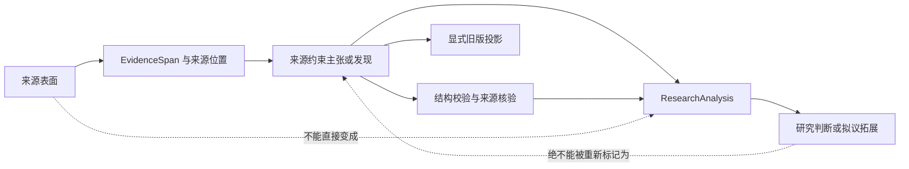

# PaperReading 学术研究底层逻辑

[English](RESEARCH_PRINCIPLES.md) | **简体中文**

- 状态：项目规范性契约
- 适用范围：Core 模型、摄取、提取适配器、校验、核验、分析、导出、Skill、文档及未来集成

## 目的

PaperReading 的首要定位不是摘要系统，而是在自动化发生后，仍能让研究资产接受质疑、来源检查和过程重建的基础设施。

本文从可辩护学术研究的最低要求出发，推导项目不可让步的底层逻辑。它是一份设计契约，不代表软件能够判断科学真理，也不代表软件能够替代专家评审。

## 第一性原理推导

1. 学术研究通过可被他人检查、质疑和修正的主张积累知识。
2. 如果不知道主张的来源证据、推断路径、前提假设和不确定性，就无法评价该主张。
3. 自动化工作流只有在保留这些要素时才值得信任；流畅文本或不可解释分数不能替代这些要素。
4. 因此，PaperReading 必须优先保证认识论完整性与可审计性，其优先级高于速度、便利性或传播指标。

法律授权、研究伦理、隐私、知情同意和来源许可属于硬约束。在这些约束允许的范围内，项目决策遵循以下优先级：

```text
认识论完整性
  > 可审计性
  > 可复现性
  > 互操作性与向后兼容
  > 易用性与性能
  > 增长指标
```

兼容性、速度、自动化覆盖率或 Stars 均不能成为削弱更高优先级要求的理由。

## 不可让步原则

| 编号 | 原则 | 必须做到 | 禁止的捷径 |
|---|---|---|---|
| P1 | 保持语义边界 | 将来源材料、证据片段、论文报告主张、系统判断和拟议研究设计建模为不同对象。 | 把解释或生成想法混入论文报告发现。 |
| P2 | 主张绑定可检查证据 | 每项来源约束主张或报告结果都必须解析到证据 ID 和来源位置。 | 因为文字“看起来合理”就接受无证据陈述。 |
| P3 | 设置推断上限 | 系统认可的表述不得强于研究设计、识别策略和已核验证据所能支持的强度。 | 把相关关系、固定效应或作者修辞转化为系统认可的因果结论。 |
| P4 | 保留不确定性与缺失 | 区分未知、未报告、零结果、不适用、未运行、部分、失败和冲突；宁可弃权，不得补造。 | 填充缺失字段、静默删除零结果，或把缺少证据当作反面证据。 |
| P5 | 状态必须通过执行获得 | `verified`、`audited` 等状态只能由对应检查实际完成后产生。 | 允许调用方或模型自行指定生命周期状态或置信度。 |
| P6 | 转换过程必须可复现 | 记录来源身份与哈希、Schema 与 Pipeline 版本、配置、适用时的 Prompt/Provider、时间戳和确定性迁移。 | 静默重新解释旧资产，或隐藏非确定性输入。 |
| P7 | 面向证伪与复核设计 | 派生陈述必须暴露支持证据、假设、限制和失败报告，使审阅者能够否定它。 | 只输出最终分数、摘要或建议，不提供可检查依据。 |
| P8 | 保留研究有效性与选择语境 | 保留变量定义与测量、研究/样本/语料的纳入排除、时期、模型与标准误、识别假设、局限和外推边界。 | 把已观察语料当作完整总体，或为制造表面可比性而丢弃语境、直接合并异质研究。 |
| P9 | 将兼容性隔离在认识论核心之外 | 有损旧格式必须是丰富研究资产的显式投影，并由回归测试保护。 | 围绕 Excel 列重塑 Domain，或为保留接口而静默丢失溯源信息。 |
| P10 | 如实描述能力边界 | 只有代码、公开契约、失败行为、测试和文档全部存在，能力才算交付。 | 把路线图、宿主能力或模型可能性宣传为仓库已实现功能。 |
| P11 | 数据最小化并尊重权利 | 只处理获授权材料，避免不必要持久化，保护机密数据，测试使用可再分发或合成材料。 | 提交受版权保护论文、机密工作簿、凭据、个人路径或未授权提取文本。 |
| P12 | 保持人类责任可见 | 自动化可以组织证据并执行约束；解释和使用责任仍由研究者承担。 | 把来源核验描述为真实性，把可追溯性分数描述为研究质量，或声称工具可以替代同行评审。 |

## 将学术有效性转化为系统要求

PaperReading 本身不能确立研究有效性，但必须保留研究者评价有效性所需的信息。

| 学术要求 | 系统含义 | 使用边界 |
|---|---|---|
| 构念效度 | 保留准确构念、变量定义、测量方式、单位、来源和转换。 | 名称相似不代表构念等价。 |
| 内部效度 | 记录研究设计与识别假设，并约束因果表述。 | 来源核验不能证明识别有效。 |
| 统计结论效度 | 保留论文报告的估计值、不确定性、标准误、显著性、稳健性检验和零结果。 | 统计显著不等于效应大小、实质重要性或结果可靠。 |
| 外部效度与覆盖范围 | 保留总体、样本、时期、地域、制度语境、语料/检索边界、排除条件和已声明限制。 | 结论不得超出已记录支持范围；在已审阅语料中未发现，不等于整个文献中不存在。 |
| 可靠性与可复现性 | 对研究资产与转换进行版本化，保留哈希、配置和运行元数据。 | Provider 重跑可能仍非确定，必须明确披露。 |
| 可证伪性与透明度 | 暴露证据链接、假设、冲突、部分状态和机器可读失败报告。 | 没有复核路径的流畅解释并不充分。 |
| 研究伦理与合法性 | 执行来源边界、保密、数据最小化和再分发限制。 | 公开可访问不等于有权复用或再分发。 |

## 必须保持的语义区别

以下表达被刻意定义为不等价：

```text
论文报告主张 != PaperReading 认可的结论
来源位置已核验 != 主张为真 != 研究有效
可追溯性分数 != 真实性概率 != 论文质量
统计显著 != 效应大小 != 实质重要性
论文报告局限 != 研究者识别局限
研究拓展 != 论文报告发现
未知 != 不存在 != 零结果 != 不适用 != 未运行 != 失败
已审阅语料中未发现 != 整个文献中不存在
公共仓库 != 已获得开源许可证
```

模型、接口、导出和文档都必须保留这些区别。如果目标格式无法表达，信息损失必须显式说明，并被限制在投影层中。

## 研究对象链条



每次转换都必须可检查。禁止把生成分析反向重新标记为来源约束事实。

## 每项功能的决策门禁

功能或 Schema 变更被接受前，作者必须回答：

1. 正在创建、转换或评价的研究对象是什么？
2. 每个字段属于来源派生、机械派生、研究者撰写还是 AI 辅助？
3. 每项来源约束陈述由什么证据和来源位置支持？
4. 哪些假设和推断规则把证据连接到输出？
5. 如何表达未知、零结果、部分、冲突、失败和不适用？
6. 哪些部分可确定性复现，哪些非确定性会被记录？
7. 成功的定义是什么，哪些失败模式必须安全停止？
8. 迁移、导出或兼容投影可能损失什么信息？
9. 适用哪些隐私、版权、同意或保密边界？
10. 哪些成功路径和失败路径测试证明该契约？

只要其中任何一项没有答案，该能力就仍是草稿或路线图假说，不能被描述为已经交付。

## 研究安全完成标准

一项变更只有在适用条件下满足以下要求才算完成：

- 研究对象及其语义边界进入严格 Schema；
- 证据引用能够解析且溯源信息得到保留；
- 不确定性与弃权状态可以完成往返转换；
- 推断强度规则由程序执行，而不是只写在文档中；
- 生命周期状态来自真实检查；
- 版本与迁移行为明确；
- 成功、拒绝、部分和失败路径均有测试；
- 有损导出保持为投影，不重新定义 Core；
- 双语文档明确区分已实现行为与规划行为；
- 测试材料和输出遵守来源权利、隐私与保密要求。

## 当前执行映射

| 原则 | 当前机制 |
|---|---|
| P1、P8 | [`PaperPackage` 与 `GroundedPaperRecord`](src/paperreading/domain/package.py) 分离来源记录、分析、审计与运行元数据。 |
| P2、P5 | [`EvidenceSpan` 与核验状态](src/paperreading/domain/evidence.py)以及 Package Graph 校验拒绝未解析引用和未获得状态。 |
| P3 | [因果语言校验](src/paperreading/validation/package.py)根据研究设计与识别支持约束因果表述。 |
| P4、P7 | [`PaperDraft`](src/paperreading/domain/draft.py)保留候选项、冲突、未解析字段和审阅状态。 |
| P5、P7 | [证据核验](src/paperreading/verification/evidence.py)返回带问题说明的 verified、partial 和 failed 结果。 |
| P6 | [版本化迁移](src/paperreading/migrations/v02_to_v03.py)、Schema、确定性示例与 `RunManifest`。 |
| P9 | [旧版投影](src/paperreading/projections/legacy.py)保持在 Domain 之外并由回归测试保护。 |
| P10 | [路线图](ROADMAP.zh-CN.md)、[测试](tests)与 CI 区分已交付契约和技术假说。 |
| P11、P12 | [安全政策](SECURITY.md)、合成示例、变更安全机制与显式文档边界。 |

该映射是现状描述，不是完美证明。一旦出现某项原则被破坏的新证据，修复原则违背的优先级高于维持当前实现。

## 明确的非目标

PaperReading 不以以下事项为目标：

- 判断论文是否为真或在科学上有效；
- 替代同行评审、领域专业知识或研究者责任；
- 用单一分数压缩论文质量、真实性、新颖性或可发表性；
- 在没有独立证据时推断期刊等级或转换不同评价体系；
- 以牺牲研究完整性为代价提高自动化覆盖率或 Stars；
- 为让输出显得完整而隐藏不确定性。

当产品激励与本契约冲突时，以本契约为准。
