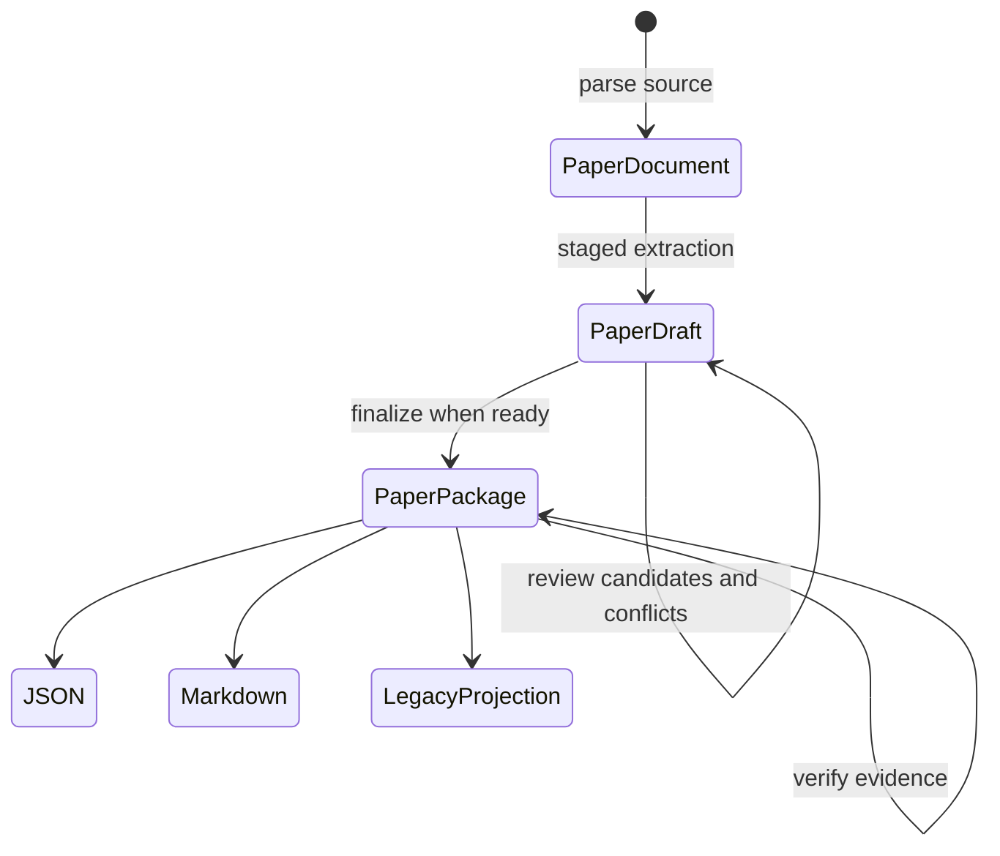

# Architecture

**English** | [简体中文](architecture.zh-CN.md)

PaperReading turns an input source into a reviewable research asset without allowing an interface, model provider, or exporter to redefine the evidence rules. The architecture is organized around one invariant:

> A structured claim is publishable only when its source identity, evidence links, extraction decision, and verification state remain inspectable.

## Dependency direction

```text
domain <- ingestion / providers / verification / validation / migrations
       <- application use cases <- CLI / Skill / repositories / exporters
```

The domain has no dependency on Typer, OpenPyXL, pypdf, a model SDK, storage, or Codex. Optional integrations implement ports around the domain rather than adding provider-specific fields to it.

## Artifact flow



The four primary artifacts have different responsibilities:

| Artifact | Responsibility | May contain uncertainty? |
|---|---|---:|
| `PaperDocument` | Stable evidence surface, source manifest, pages, blocks, and offsets | Parser limitations remain explicit |
| `PaperDraft` | Candidate values, conflicts, unresolved fields, and extraction issues | Yes |
| `ExtractionBundle` | Draft plus evidence graph and provider/run identity across CLI steps | Yes |
| `PaperPackage` | Validated grounded record, evidence index, separate analysis, and run manifest | No unresolved extraction state |

## Source identity

PaperReading records two hashes because they answer different questions:

- `DocumentManifest.sha256` identifies the exact source bytes.
- `PaperDocument.canonical_text_sha256` identifies NFC-normalized extracted text with normalized line endings and page separators.

Finalization checks both the document ID and canonical text hash. This prevents a reviewed draft from being finalized against changed extracted text while still preserving the identity of the original binary.

## Parser port

`DocumentParser` exposes `supports(path)` and `parse(path, ingested_at=...)`. v0.3.1 ships:

- `TextDocumentParser` for UTF-8 text and Markdown;
- `PdfDocumentParser` as an optional pypdf adapter for PDFs with an existing text layer.

The PDF adapter preserves page boundaries but does not claim OCR, geometry, reading-order correctness, table reconstruction, or figure extraction. An empty text surface fails explicitly and directs the caller to an OCR adapter.

## Provider port and review boundary

An `ExtractionProvider` receives one `ExtractionTask` per stage and returns:

- typed candidates with field paths and evidence IDs;
- normalized evidence spans;
- unresolved fields and issues;
- a prompt version when applicable.

Stages cover metadata, research questions, theory, data, variables, design, findings, mechanisms, heterogeneity, robustness, limitations, and analysis. The shipped `JsonExtractionProvider` only replays an inspectable manifest; it does not make a network or model call.

Conflicting values are preserved rather than resolved by ordering. `ReviewDraft` auto-selects a field only when it has one candidate; multiple candidates require an explicit candidate ID. Unresolved optional fields may be dismissed explicitly, but required record fields still fail model validation.

A provider may propose evidence spans, but it cannot attach verification results to them. Only the independent verifier can produce `EvidenceVerification` state.

## Finalization gates

`FinalizeDraft` rejects a bundle when:

1. the draft is not `ready_to_finalize`;
2. the document ID or canonical text hash changed;
3. more than one candidate remains for a field;
4. candidate field paths overlap or target an unsupported root;
5. the resulting grounded record violates the v0.3 schema; or
6. a record or analysis object references absent evidence.

The run manifest records pipeline version, exact source hash, configuration hash, provider and provider version, optional model, prompt versions, and a timezone-aware timestamp. It never stores provider secrets.

## Evidence Verification v2

Verification resolves source, page, block, character range, section path, quotation, and text-hash dimensions independently. Exact quotation matches score `1.0`. When extraction noise prevents an exact match, a conservative local-window aligner compares the quotation with likely nearby windows instead of the entire paragraph. A configured threshold still decides pass or failure.

Verification proves locator resolution against the supplied `PaperDocument`; it does not prove that a finding is true, a study is high quality, or an identification strategy is valid. Unsupported table, figure, equation, and geometry locators remain `partial`.

## Compatibility and extension rules

- v0.2 `PaperRecord` remains supported and migrates deterministically to v0.3.
- Legacy Excel output is produced only through the 13-field projection.
- New parsers, providers, repositories, and exporters should implement ports without importing their dependencies into the domain.
- A new public domain contract requires a version decision, migration analysis, failure-path tests, regenerated schemas and examples, and aligned bilingual documentation.
