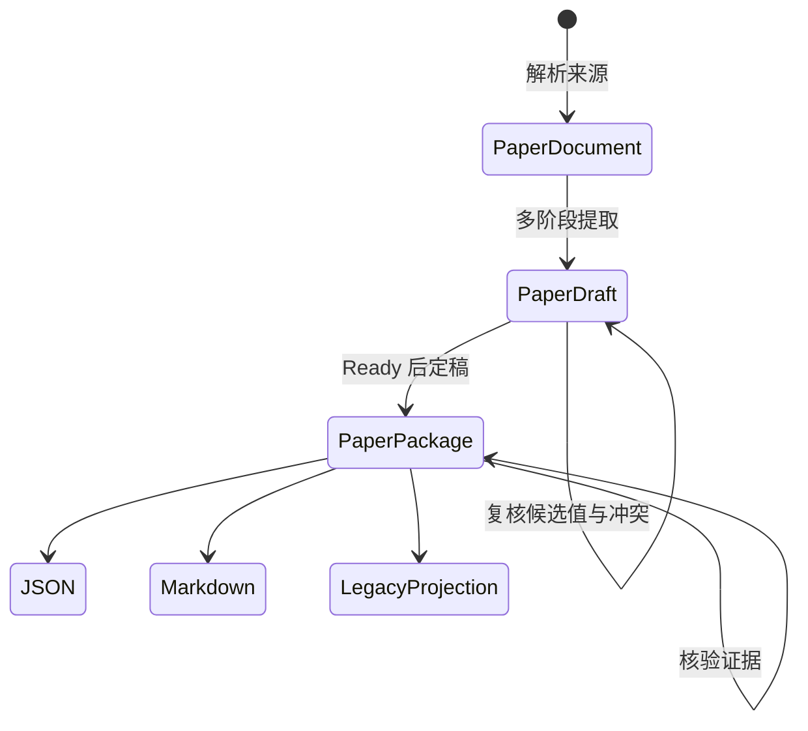

# 架构说明

[English](architecture.md) | **简体中文**

PaperReading 将输入来源转化为可复核研究资产，同时禁止 Interface、模型 Provider 或 Exporter 重新定义证据规则。整个架构围绕一项不变量组织：

> 只有来源身份、证据链接、提取决策与核验状态都可检查时，结构化主张才可以发布。

## 依赖方向

```text
domain <- ingestion / providers / verification / validation / migrations
       <- application use cases <- CLI / Skill / repositories / exporters
```

Domain 不依赖 Typer、OpenPyXL、pypdf、模型 SDK、Storage 或 Codex。可选集成在 Domain 外实现 Port，而不是把 Provider 专属字段写入 Domain。

## 研究资产流



四类主要研究资产承担不同责任：

| 研究资产 | 职责 | 是否允许保留不确定性 |
|---|---|---:|
| `PaperDocument` | 稳定证据表面、来源清单、页、文本块与偏移 | 明确保留 Parser 局限 |
| `PaperDraft` | 候选值、冲突、未决字段与提取问题 | 是 |
| `ExtractionBundle` | 在 CLI 步骤之间共同保存 Draft、证据图与 Provider / Run 身份 | 是 |
| `PaperPackage` | 已校验来源记录、证据索引、独立 Analysis 与 Run Manifest | 不允许未解决提取状态 |

## 来源身份

PaperReading 记录两个哈希，因为二者回答不同问题：

- `DocumentManifest.sha256` 标识精确来源二进制。
- `PaperDocument.canonical_text_sha256` 标识 NFC 规范化、统一换行并保留分页符的提取文本。

定稿同时检查 Document ID 与规范化文本哈希，防止已复核 Draft 被用于已经变化的提取文本，同时仍保留原始二进制身份。

## Parser Port

`DocumentParser` 暴露 `supports(path)` 与 `parse(path, ingested_at=...)`。v0.3.1 提供：

- 面向 UTF-8 文本与 Markdown 的 `TextDocumentParser`；
- 面向已有文本层 PDF 的可选 pypdf 适配器 `PdfDocumentParser`。

PDF 适配器保留页边界，但不声称具备 OCR、几何定位、正确阅读顺序、表格重建或图形提取能力。没有可提取文本时会显式失败，并提示调用方使用 OCR 适配器。

## Provider Port 与复核边界

`ExtractionProvider` 每个阶段接收一个 `ExtractionTask`，并返回：

- 带字段路径和证据 ID 的类型化 Candidate；
- 规范化 EvidenceSpan；
- 未决字段与问题；
- 适用时的 Prompt 版本。

阶段覆盖 Metadata、Research Question、Theory、Data、Variable、Design、Finding、Mechanism、Heterogeneity、Robustness、Limitation 与 Analysis。当前 `JsonExtractionProvider` 只重放可检查 Manifest，不进行网络或模型调用。

冲突值会被保留，而不会按顺序覆盖。只有一个 Candidate 时，`ReviewDraft` 才会自动选择；多个 Candidate 必须显式提供 Candidate ID。可选未决字段可以被显式忽略，但必填记录字段仍会在模型校验阶段失败。

Provider 可以提出 EvidenceSpan，但不得为其附加核验结果。只有独立 Verifier 可以生成 `EvidenceVerification` 状态。

## 定稿守卫

以下情况会被 `FinalizeDraft` 拒绝：

1. Draft 尚未达到 `ready_to_finalize`；
2. Document ID 或规范化文本哈希发生变化；
3. 同一字段仍有多个 Candidate；
4. Candidate 字段路径重叠或指向不支持的根；
5. 生成的来源记录违反 v0.3 Schema；
6. Record 或 Analysis 引用了不存在的证据。

Run Manifest 记录 Pipeline 版本、精确来源哈希、配置哈希、Provider 及其版本、可选 Model、Prompt 版本与带时区时间；绝不存储 Provider 密钥。

## Evidence Verification v2

核验器分别解析来源、页码、文本块、字符区间、章节路径、引文与文本哈希。精确引文匹配得分为 `1.0`。提取噪声导致无法精确匹配时，保守的局部窗口对齐器会比较引文与可能的附近窗口，而不是整个长段落；最终仍由配置阈值决定通过或失败。

核验只能证明 Locator 可以在给定 `PaperDocument` 中解析，不能证明结论真实、研究质量较高或识别策略有效。不支持的表格、图形、方程和几何 Locator 必须保持 `partial`。

## 兼容与扩展规则

- v0.2 `PaperRecord` 继续受支持，并可确定性迁移到 v0.3。
- 旧版 Excel 只能通过 13 字段 Projection 输出。
- 新 Parser、Provider、Repository 与 Exporter 应实现 Port，不得把依赖导入 Domain。
- 新公开 Domain 契约必须完成版本判断、迁移影响分析、失败路径测试、Schema 与示例重生成，以及中英文文档同步。
